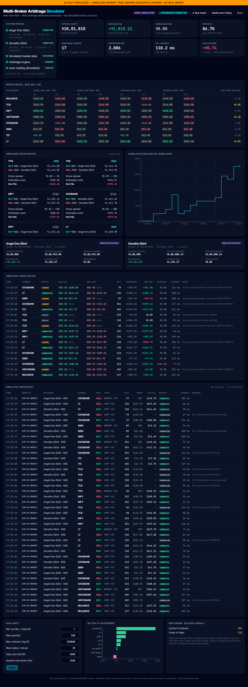
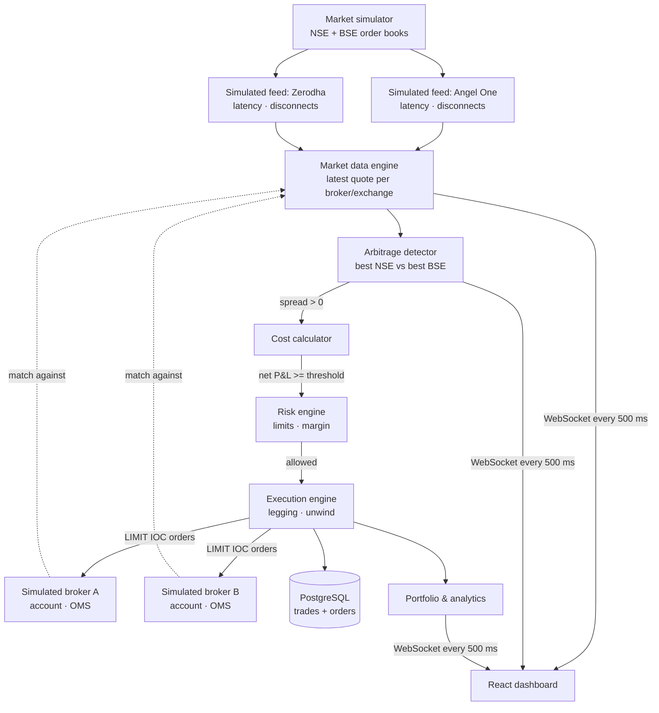

# ⚡ Multi-Broker Arbitrage Simulator

**Real-time multi-broker NSE ↔ BSE arbitrage detection and execution, fully simulated end to end**

🔗 **Live demo:** https://arbitrage-simulator.onrender.com (free instance: the first load can take ~1 minute to wake up)

> ⚠️ **100% SIMULATED.** The market feed, the broker accounts, the orders and the money are all simulated in-process.
> The project contains no real broker or exchange integration and needs no credentials.
> It is an engineering portfolio project, not a trading system.



## What it does

The same stock trades on both NSE and BSE, and for brief moments their prices drift apart.
This system simulates that market and **two broker accounts** (modelled on Angel One and Zerodha charges and latency),
streams quotes for both exchanges from each simulated broker feed, finds moments when you could
*buy on one exchange and sell on the other*, subtracts realistic Indian transaction costs, and sends both legs as
**simulated orders** to the simulated brokers: with latency, slippage, margin checks, competition for liquidity and the
risk of only one leg filling.

| Simulated component | What it does |
|---|---|
| Market | True price random walk per stock, separate NSE/BSE books, spreads, depth, short dislocations |
| Broker feeds | Two feeds with their own network latency, latency spikes and random disconnects |
| Broker accounts | Virtual capital per broker, client ID, balance, used/available intraday margin (5x), realised P&L, charges |
| Orders | Order IDs, LIMIT/MARKET, IOC validity, OPEN → COMPLETE / CANCELLED / REJECTED, fill price, latency, reason |

### Features

1. Realistic **market simulator** and two simulated broker WebSocket-style feeds (no credentials needed)
2. **Simulated broker accounts** with margin blocking and per-account P&L and charges
3. **Simulated order management**: every leg is a real order object with an ID, status and rejection/cancel reason
4. Real-time bid/ask comparison across 2 brokers × 2 exchanges
5. Arbitrage detection with per-episode tracking (a spread lasting 2 s counts once, not 8 times)
6. Transaction-cost calculator: brokerage, STT, exchange charges, SEBI fee, stamp duty, GST
7. Simulated execution of both legs with simulated order latency, slippage and fill competition
8. **Legging risk**: if one leg misses, the open position is marked to market, then squared off with a simulated MARKET order
9. Virtual portfolio with realised and unrealised P&L
10. Order execution latency tracking (p50 / p95)
11. Feed reconnect handling with exponential backoff (feeds *and* dashboard)
12. Risk limits, editable live: min net P&L, max quantity, max notional, trades/minute, daily loss limit, cool-downs, margin
13. Trade and order history persisted to PostgreSQL / SQLite
14. Performance analytics: win rate, P&L by instrument, slippage, blocked signals

## Architecture



| Layer | Tech |
|---|---|
| Backend | Python 3.12, FastAPI, asyncio, WebSockets, SQLAlchemy 2 |
| Database | PostgreSQL (Neon / Render) or SQLite locally |
| Frontend | React 18, TypeScript, Tailwind CSS 4, Recharts, Vite |
| Simulation | Market, broker feeds, broker accounts and order matching, all in-process |
| Deploy | Docker, Render (single web service) |
| Tests | pytest (15): cost model, detector, execution, simulated broker, API + WebSocket |

### Project structure

```
backend/
  app/
    feeds/        base.py (reconnect/backoff), simulator.py (market + simulated broker feeds)
    broker/       simulated.py (virtual accounts, margin, order management + matching)
    engine/       market.py, detector.py, costs.py, paper.py (execution)
    db.py         trade persistence
    main.py       FastAPI app, REST API, WebSocket
  tests/
frontend/src/     App.tsx (dashboard), useLiveData.ts (WebSocket hook), types.ts
```

## How a simulated trade works

1. Each quote update triggers the detector for that symbol.
2. Best **ask** and best **bid** are taken per exchange across both brokers (stale quotes > 1 s are ignored).
3. If `bid(BSE) > ask(NSE)` (or the reverse), quantity = min(depth on both sides, max quantity, max notional).
4. Costs for both legs are computed. If net P&L ≥ the threshold and risk checks pass (including 20% intraday margin
   available on both simulated accounts), two **LIMIT IOC orders** are placed with the simulated brokers.
5. Each broker blocks margin, waits a realistic order latency, then matches the order against its current simulated quote:
   `COMPLETE` if the price is still within 1 tick, otherwise `CANCELLED` ("price moved" or "liquidity taken by another trader",
   see `FILL_COMPETITION`). Orders without margin are `REJECTED`. Margin is released when the order finishes.
6. Both filled → **COMPLETED**. One filled → **LEGGED** (position held with margin blocked, marked to market, squared off
   with a MARKET order after 2–4 s). None → **MISSED**.
7. P&L and charges are booked to the simulated accounts (a completed arbitrage splits them between both accounts).

## Cost model (approximate)

| Charge | Rate used |
|---|---|
| Brokerage | ₹20 or 0.03% per order, whichever is lower |
| STT | 0.025% on the sell side (intraday) |
| Exchange transaction | NSE 0.00297%, BSE 0.00375% |
| SEBI fee | ₹10 per crore |
| Stamp duty | 0.003% on the buy side |
| GST | 18% on brokerage + exchange + SEBI |

Rates change. Check each broker's current charge sheet.

## API

| Method | Path | Description |
|---|---|---|
| GET | `/api/health` | Health check |
| GET | `/api/status` | Feed states, latency, engine and trading status |
| GET | `/api/quotes` | Latest bid/ask for every broker × exchange × symbol |
| GET | `/api/opportunities` | Detector stats and recent opportunities |
| GET | `/api/portfolio` | Equity, realised/unrealised P&L, open legged positions |
| GET | `/api/analytics` | Win rate, latency, P&L series, per-symbol stats |
| GET | `/api/trades?limit=&symbol=` | Persisted trade history |
| GET | `/api/accounts` | Simulated broker accounts: balance, margin, P&L, charges |
| GET | `/api/orders?limit=&broker=&status=&symbol=` | Simulated order book (current session) |
| GET | `/api/orders/history?limit=&broker=&status=` | Persisted simulated orders |
| GET / PUT | `/api/risk` | Read / update risk limits |
| POST | `/api/engine/{start\|stop}` | Pause or resume detection |
| POST | `/api/trading/{enable\|disable\|reset}` | Control auto-trading / reset accounts |
| WS | `/ws` | Full live snapshot every 500 ms |

Interactive docs: `/docs` (Swagger UI).

## Database schema

```sql
CREATE TABLE paper_trades (
  id            VARCHAR(16) PRIMARY KEY,
  created_at    TIMESTAMPTZ DEFAULT now(),
  symbol        VARCHAR(32),
  status        VARCHAR(16),     -- COMPLETED | LEGGED | MISSED
  quantity      INTEGER,
  expected_net  FLOAT,           -- P&L expected at detection
  gross_pnl     FLOAT,
  costs         FLOAT,
  net_pnl       FLOAT,
  slippage      FLOAT,           -- + worse / - better than detected prices
  latency_ms    FLOAT,
  buy_leg       JSON,            -- exchange, broker, limit, fill_price, status, latency
  sell_leg      JSON,
  note          VARCHAR(255)
);

CREATE TABLE paper_orders (
  order_id      VARCHAR(24) PRIMARY KEY,  -- e.g. SIM-ZD-000042
  created_at    TIMESTAMPTZ DEFAULT now(),
  broker        VARCHAR(16),
  exchange      VARCHAR(8),
  symbol        VARCHAR(32),
  side          VARCHAR(4),       -- BUY | SELL
  order_type    VARCHAR(8),       -- LIMIT | MARKET
  quantity      INTEGER,
  price         FLOAT,
  status        VARCHAR(12),      -- COMPLETE | CANCELLED | REJECTED
  fill_price    FLOAT,
  latency_ms    FLOAT,
  reason        VARCHAR(255),
  trade_id      VARCHAR(16)       -- arbitrage trade this order belongs to
);
```

## Run locally

```bash
# backend
cd backend
python -m venv .venv
.venv\Scripts\activate            # macOS/Linux: source .venv/bin/activate
pip install -r requirements-dev.txt
pytest                            # 15 tests
uvicorn app.main:app --reload     # http://localhost:8000/docs

# dashboard (second terminal)
cd frontend
npm install
npm run dev                       # http://localhost:5173 (proxies /api and /ws to :8000)
```

Or build the dashboard once (`npm run build`) and open http://localhost:8000. FastAPI serves it.

## Configuration

All optional, see `.env.example`: `STARTING_CAPITAL` (split across the two simulated accounts), `FILL_COMPETITION`,
`SIM_DISCONNECTS`, `DATABASE_URL`.

## Deploy (Render)

1. Push to GitHub, then on Render choose **New → Blueprint** and select the repo (uses `render.yaml` + `Dockerfile`).
2. Optional: add `DATABASE_URL` from a free Neon Postgres to keep trade history across restarts.

## Limitations

- Everything is simulated, including the brokers. "Angel One (Sim)" and "Zerodha (Sim)" only borrow those brokers' published
  charges and typical latency; the project is not connected to or endorsed by either.
- Simulated market behaviour is a model. Real NSE/BSE gaps are rarer and are competed away by HFT firms in microseconds.
- Retail broker latency is tens of milliseconds, so opportunities like these would be very hard to capture in practice.
- Costs are approximations of published rate cards. Margin is a flat 20% intraday rate.
